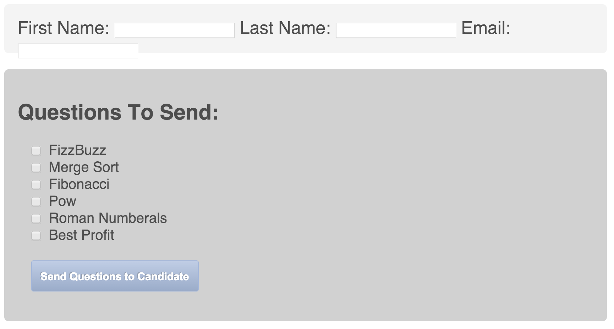

# Giterate
Enhanced code testing suite that includes checks for linting, programmer tendencies, and time and space complexity, and supplies the user with a comprehensive visualization of this data for self-improvement and hiring standards.

Copy and paste this code in the input boxes (check the last 3 algorithm options):

function pow(base, exponent) {
if (exponent == 0) return 1;
else return base * power(base, exponent - 1);
}

function romanNumeral(n) {
/*
Approach: turn n into a string, split it by each digit, push into array,
iterate through array from the end, if last digit is a   
*/
var numerals = [  1000,'M', 900,'CM',500 ,'D',400,'CD', 100,'C',90,'XC',50,'L',40,'XL', 10,'X', 9,'IX', 5,'V',4,'IV',1, 'I'];
var res = '';

while (n >0){
for (var i = 0; i < numerals.length; i+=2){
if (numerals[i] <= n){
res += numerals[i+1];
n -= numerals[i]; 
break; 
}
console.log('res', res, 'input', n);
}

}
return res;

}

function mergeSort(arr) {

var res = []; 
if (arr.length > 1) {
var left = mergeSort(arr.slice(0, Math.floor(arr.length / 2))); 
var right = mergeSort(arr.slice(Math.floor(arr.length / 2))); 
}
else {
return arr;
}
while(left.length && right.length){
if (left[0] < right[0]) res.push(left.shift()); 
else (res.push(right.shift()));
}
return res.concat(left, right);
}

